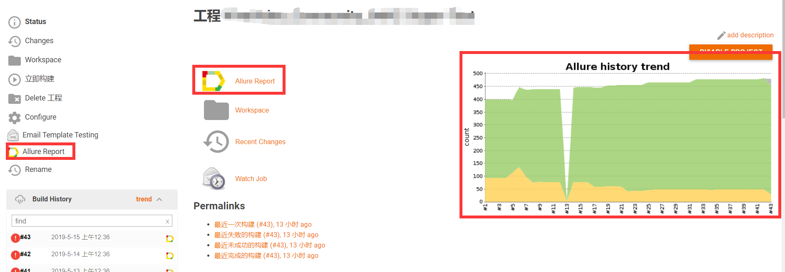
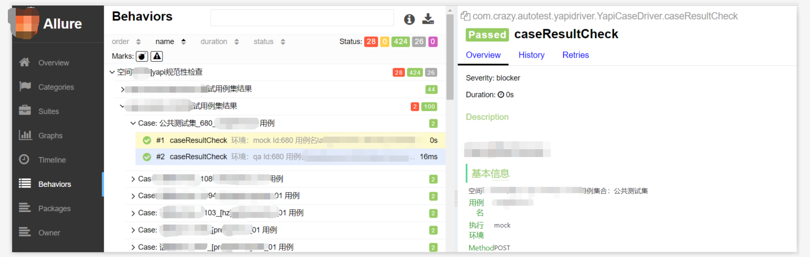
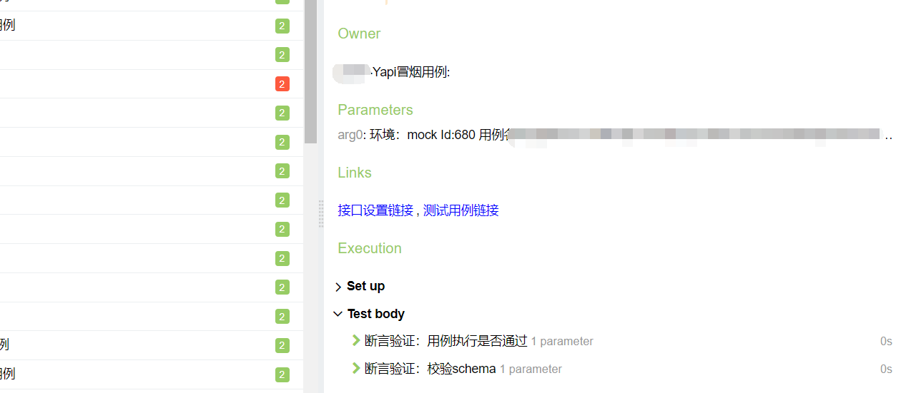
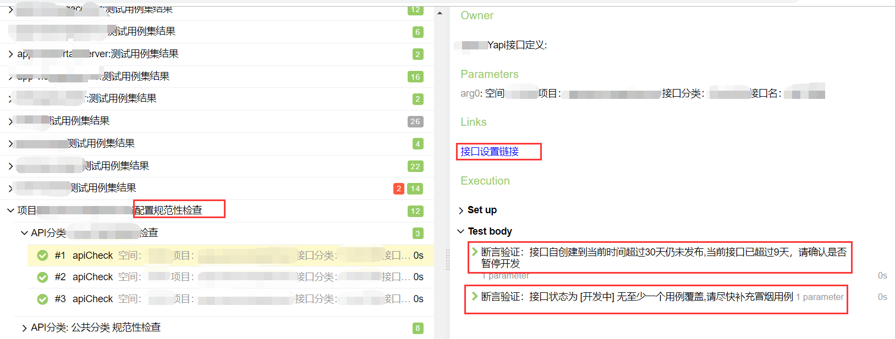

## yapi 接口监控工具
集成yapi testng allure2，在allure2 测试报告中显示yapi接口定义情况，执行yapi中的接口用例

## 强烈推荐 yapi接口监控平台

<a target="_blank" href="http://yapi.demo.qunar.com">yapi.demo.qunar.com</a>

##  crazy-yapi分支地址
https://github.com/xian-crazy/yapi
demo 站点 http://crazy-yapi.camdy.cn

## 使用说明

###  环境
* maven
* allure2  https://github.com/allure-framework/allure2
* java8
* jenkins（可选）

### 从入门到迷茫
1. 下载casedemo工程 https://github.com/xian-crazy/casedemo
2. 修改配置文件

       配置文件src/main/resources/config/yapi/projectinfo.properties  配置如下
       #crazy yapi 部署地址
       yapi.addr=crazyyapi.company.com
       #监控yapi的账户,需要将该账户添加为需要监控的空间的[组长]身份  登陆账户|密码
       yapi.watcher=账户|密码
       #yapi监控全局token，见yapi服务的config.json:godtoken
       yapi.godtoken=我爱你，我的祖国，我为你骄傲!
       #被监控测试的groupId
       spaceIds=0
       #指定需要监控的项目，0表示该空间下所有项目
       projectid=0
       #指定需要执行的用例集，0表示该空间下所有项目
       casecolid=0

3. 执行maven命令（注意修改命令中的监控参数）

        clean test -Dsuite=yapi.xml -Dallure.results.directory=target/allure-results -DspaceIds=57
          -DspaceIds值可选形式如下  其他值配置相同
          不传该参数：使用projectinfo.properties中的默认配置
          传一个值监控一个空间：-DspaceIds=57
          传入多个值监控多个空间：-DspaceIds=57,22
          执行结束后，在当前工程目录下执行：allure serve target/allure-results 查看allure格式化结果的报告
          可集成jenkins 自行网搜解决方案（样例见下图）

4. 命令行/powershell中，在casedemo工程目录下，执行allure 命令：  IdeaProjects\casedemo> allure serve target/allure-results
5. 会自动打开浏览器看到炫酷的报告
6. 网搜下如何集成allure和jenkins，文章一大堆
 

## 报告截图

